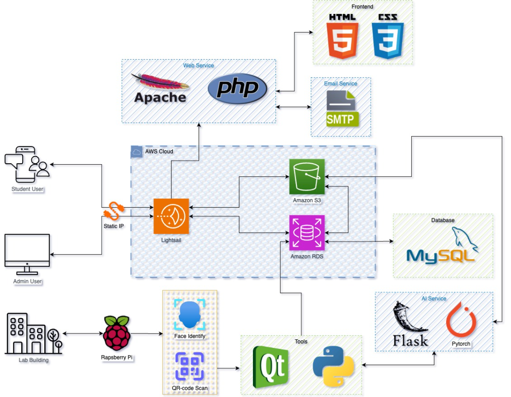

# Lab Reservation System

This project is part of our Capstone Design Project for Sungkyunkwan University.

## Overview
The **Lab Reservation System** is a web-based platform designed to simplify laboratory scheduling and management. It allows students to book labs online, receive updates via email, and view real-time availability. Lab managers can efficiently manage bookings, schedules, and notifications.

## Related Repositories
- [Lab Access System - Software for Raspberry Pi](https://github.com/ICE3037-2024Fall-Team2/lab_access_system)  
   *(This repository contains the software we developed for lab access control, facial recognition and QR code processing.)*

---

## Full Project Architecture
- **Frontend**:
  - Built with **HTML**, **CSS**, **JavaScript**, **jQuery**, and **AJAX**.
  - Responsive design for both desktop and mobile users.
- **Backend**:
  - Powered by **PHP** and deployed on **AWS Lightsail**.
  - Uses APIs for managing reservations, facial recognition, and notifications.
- **Database**:
  - Managed with **MySQL** and hosted on **AWS RDS**.
- **AI and Hardware Integration**:
  - Facial recognition using **DeepFace Library** with the **ArcFace Model**.
  - **Raspberry Pi 5** and **Camera 3** for processing and access control.
- **Deployment**:
  - Images stored on **AWS S3** and served through pre-signed URLs.
  - SMTP service via **Google** for email notifications.

## System Flow

(The diagram shows the interaction between the frontend, backend, database, and hardware components.)

---

## Lab Reservation System Features
### Student
- **Online Reservations**: Book available lab slots through an intuitive interface.
- **Reservation Status Updates**: Receive email notifications for confirmations, approvals, or rejections.
- **Lab Schedule Overview**: View and manage upcoming reservations.
  
### Admin
- **Manage Reservations**: Approve or reject lab bookings and send automated notifications.
- **Lab Scheduling**: Manage lab availability and prevent scheduling conflicts.
- **Admin Tools**: Add or remove administrators to handle lab management.

## Frontend Flowchart
Below is a flowchart that illustrates the sequence of interactions and transitions between different user interfaces or screens in our application.

---

## Challenges and Solutions
- **Consistent Styling**: Reused shared CSS files to ensure uniform design across pages.
- **Mobile Responsiveness**: Implemented media queries for a seamless experience on smaller screens.
- **Real-Time Email Notifications**: Integrated Google SMTP for reliable delivery.
- **Preventing Past Reservations**: Added rules to exclude past time slots when fetching schedules.

---

## Future Enhancements
- Add multi-language support for broader accessibility.
- Incorporate analytics dashboards for lab usage trends and performance tracking.

---

## Contributors
- **Igor Briukhov** (Frontend, Backend, Testing, Team Leader)
- **Yiqin Wei** (Backend, Database, Cloud System)
- **Truong Khanh Nhi** (Frontend)

---

## References
- **SKKU GLS System**: Inspired the frontend design to align with existing university systems.
- **AWS Documentation**: Provided deployment guidance for Lightsail, RDS, and S3.
